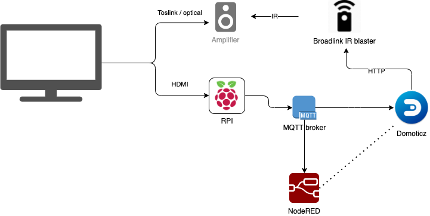

# RPI Soundbar - HDMI CEC MQTT bridge with ARC support

Allows controlling volume of your legacy amplifier with TV's physical or soft remote (Android TV and
during casting).

Audio is taken from TV using typical optical or coax link and sent to amplifier, while
control commands are read from HDMI CEC. On my Philips TV, if TV's builtin speakers are disabled there
are no keypress commands sent over HDMI-CEC. This container image solves this by imitating HDMI sound
system (a soundbar), that connects to TV using single HDMI cable. TV has to be configured to use a HDMI sound system and Raspberry Pi must be connected to HDMI port supporting HDMI ARC.

Toslink audio output typically remains
active whatever the configuration on TV allowing amplifier to function, while Raspberry Pi reads control signals and remote keypresses from HDMI cable
using CEC protocol.

This runs as docker container on Raspberry Pi and uses a patched libcec to support ARC signalling protocol.

## Operational diagram



## Requirements

* Docker installed on Raspberry Pi
* MQTT broker (like [Mosquitto](https://mosquitto.org/))

## Starting up

Requires `--privileged` and `--device /dev/mem:/dev/mem` option to be able to work HDMI hardware.

```shell
docker run -d --privileged \
    --name mqtt-audio-controller \
    --device /dev/mem:/dev/mem \
    -e MQTT_BROKER="192.168.0.2" \
    -e MQTT_PORT="1883" \
    -e MQTT_PREFIX="media" \
    -e MQTT_USER="cec-mqtt" \
    -e MQTT_PASSWORD="strongpass" \
    -e CEC_ENABLED="1" \
    -e CEC_PORT="RPI" \
    -e CEC_DEVICES="0,8" \
    ingemars/mqtt-audio-controller > /dev/null
```

* MQTT_BROKER - IP address / hostname of MQTT broker
* MQTT_PORT -  MQTT broker port, typically "1883"
* MQTT_PREFIX - prefix for MQTT topic
* MQTT_USER - MQTT password as registered with broker
* MQTT_PASSWORD - MQTT password as registered with broker
* CEC_ENABLED - set to "1" to enable CEC
* CEC_PORT - HDMI port to use, "RPI" on Raspberry Pi
* CEC_DEVICES - comma separated device IDs on CEC bus to query and report status

## MQTT Topics

<!--
The bridge subscribes to the following topics:

| topic                   | body                                    | remark                                           |
|:------------------------|-----------------------------------------|--------------------------------------------------|
| `prefix`/cec/`id`/cmd   | `on` / `off`                            | Turn on/off device with id `id`.                 |
| `prefix`/cec/cmd        | `mute` / `unmute` / `voldown` / `volup` | Sends the specified command to the audio system. |
| `prefix`/cec/tx         | `commands`                              | Send the specified `commands` to the CEC bus. You can specify multiple commands by separating them with a space. Example: `cec/tx 15:44:41,15:45`. |
| `prefix`/ir/`remote`/tx | `key`                                   | Send the specified `key` of `remote` to the IR transmitter. | -->

The bridge publishes to the following topics:

| topic                   | body                                    | remark                                           |
|:------------------------|-----------------------------------------|--------------------------------------------------|
| `prefix`/cec/`id`       | `on` / `off` | Report power status of device with id `id`, where `id` 0 is TV. |
| `prefix`/cec/volumeup | `on` | Notify that volume UP was pressed. |
| `prefix`/cec/volumedown | `on` | Notify that volume DOWN was pressed. |
| `prefix`/cec/volumemute | `on` | Notify that MUTE was pressed. |

`id` is the address (0-15) of the device on the CEC-bus.


## Some notes

* To avoid TV turning on every RPI restart disable TV service on RPI with command `tvservice --off`
* To debug MQTT use command `docker run --rm -it --entrypoint mosquitto_sub jllopis/mosquitto:v1.6.9 -u user -P pass -v -d -h 192.168.0.2 -p 1883 -t 'media/#`, where media is the prefix used for CEC topics

## Interesting links

* [https://github.com/nvella/mqtt-cec](https://github.com/nvella/mqtt-cec)
* [http://www.cec-o-matic.com/](http://www.cec-o-matic.com/)
* [http://wiki.kwikwai.com/index.php?title=The_HDMI-CEC_bus](http://wiki.kwikwai.com/index.php?title=The_HDMI-CEC_bus)
* [https://github.com/Pulse-Eight/libcec](https://github.com/Pulse-Eight/libcec)
* [https://github.com/iasmanis/libcec](https://github.com/iasmanis/libcec)
* [https://github.com/jonaseck2/cec-mqtt-bridge](https://github.com/jonaseck2/cec-mqtt-bridge)
